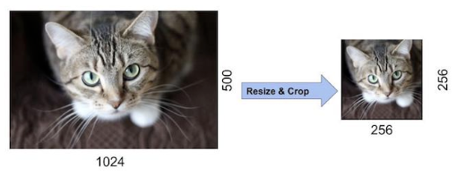

# Alexnet

Progress: Done
Tags: CNN, Done
URL: https://proceedings.neurips.cc/paper/2012/file/c399862d3b9d6b76c8436e924a68c45b-Paper.pdf
논문 출판일: 2012년 9월 30일
리뷰 시작 날짜: 2022년 9월 11일
최종 편집 일시: 2023년 6월 10일 오후 3:11

[NIPS-2012-imagenet-classification-with-deep-convolutional-neural-networks-Paper.pdf](NIPS-2012-imagenet-classification-with-deep-convolutional-neural-networks-Paper.pdf)

### Abstract

- Imagenet NSVRC-2010 대회의 1.2 milon 개의 고해상도 이미지를 1000개의 서로 다른 클래스로 분류하기 위해 크고 깊은 CNN을 학습시킴.
    
    → 5개의 convolution 레이어, max-pooling layer, 1000-way의 소프트맥스를 갖추며 총 3개의 fully-connected layer로 이루어짐
    

### 1. Introduction

- 최근 object recognition 분야는 머신러닝에서 사용되는 방식을 사용하고 있음
    
    → 퍼포먼스 향상을 위해 대량의 데이터를 수집
    
    → 좀 더 파워풀한 모델 구축
    
    → 과적합을 방지하기 위한 여러 기법 활용 등
    

- 최근 작은 사이즈의 데이터셋 같은 경우에는 거의 인간과 유사한 성능을 내고 있기도 함
    
    ex) MNIST dataset
    
    → 그러나 현실의 데이터셋은 매우 복잡하기 때문에 좀 더 큰 데이터셋을 학습에 사용해야함.
    
    → 하지만 최근에 와서야 LabelMe나 ImageNet과 같은 라벨링된 대용량 데이터의 사용이 가능해짐
    

- 수백만장의 사진에서 학습하려면 많은 학습이 가능한, 학습 capacity가 큰 모델이 필요함.
    
    → 하지만 현실 세계가 너무 복잡해 ImageNet 수준의 데이터로도 현실을 커버할 수 없음
    
    → 그러니 우리는 우리가 갖고있지 않은 데이터도 커버할 수 있을 정도의 방대한 사전 지식을 가진 모델을 만들어야함.
    

- CNN은 위의 요구사항을 충족하기에 적합한 모델임.
    
    → 모델의 capacity가 depth나 breath에 의해 조절될 수 있음
    
    → 이미지의 특성에 대해 강력하면서도 대부분 정확한 가정을 하고 있음
        (통계의 고정성과 픽셀 의존성의 지역성)
    

- 그리고 비슷한 수준의 Feedforward Neural network와 비교해서 성능이 아주 약간 나쁠 순 있지만 훨씬 적은 connection과 parameter를 가져갈 수 있기 때문에 학습이 훨씬 용이함

- CNN의 매력적인 특성과 local architecture의 효율성에도 불구하고, 해당 모델을 대규모의 고해상도 이미지에 적용시키기에는 cost가 비싼 편임.
    
    → but 2차원 합성곱의 최적화된 구현 방식과 오늘날의 발전된 GPU는 CNN을 이용한 학습을 가능하게 할 정도로 강력해짐 
    
    → 그리고 ImageNet과 같은 dataset엔 모델을 과적합 없이 훈련시킬 수 있을 정도로 충분한 수준의 labeled 데이터가 존재함.
    

- 이 논문의 contribution은 아래와 같음.
    1. ImageNet의 일부 데이터셋을 통해 큰 사이즈의 CNN을 훈련시켜 현존하는 최고 성능을 냄
    2. 신경망 학습을 위해 GPU를 활용한 최적화된 2차원 합성곱 연산 방식을 만들고 공개함

### 2. The Dataset

- Imagenet에는 22,000개의 카테고리로 나눠져있고 1,500만개의 레이블링이 되어있는 고해상도 이미지 dataset임
- 2010년부터 ImageNet의 subset을 사용하여 1000개의 카테고리 이미지를 정확히 맞추고자 하는 ImageNet Large-Scale Visual Recognition Challenge(ILSVRC)라는 대회가 열리는 중
    
    → 총 120만 개의 훈련 이미지, 5만 개의 검증 이미지, 15만 개의 테스트 이미지
    
- 해당 논문은 ILSVRC-2010 데이터셋을 활용하여 대부분의 실험을 수행.
- ILSVRC에서는 top-1, top-5 error, 2가지 방식의 에러를 사용함
    
    → top-5 error : 모델이 예상한 상위 5가지 카테고리중 정답이 없는 경우
    

- 모델에서는 이미지를 256*256 해상도로 고정하여 다운 샘플링을 진행
    
    → 가변해상도 ⇒ 고정해상도로 변환**(해당 모델의 단점이 되는 부분)**
    
    → 직사각형 이미지가 있을 경우 짧은 쪽을 먼저 256으로 조절하고, 긴쪽을 잘라내어 256*256 이미지를 만듬
    
    → 각 픽셀별로 (이미지의 평균값 - 픽셀값)을 해줌(R, G, B 별로 한번씩 빼줌)
    
    ⇒ 이후 중앙값으로 근사된(centered) RGB 값으로 학습을 진행함(Normalization)
    

### 3. The Architecture

- 모델의 구조는 그림 2와 같음
- 8개의 층으로 구성됨(5개의 convolutional + 3개의 fully connected)

**3.1 ReLU Nonlinearity**

- 보통 모델에서 뉴런의 출력값 f(x)는 tanh나 sigmoid를 사용하는것이 일반적
    
    → 하지만 tanh나 sigmoid와 같은 포화적인 비선형성(saturating nonlinearities)는 ReLU와 같은 비포화 비선형성(non-saturating nonlinearities) 보다 훨씬 느림
    
    ⇒ ReLU의 경우 (0, $+\infin$) 로 한쪽으로는 무한히 발산할 수 있는 함수(**non-saturating, 불포화함수**)
    
    ⇒ tanh의 경우 (-1, +1) 사이에 항상 값이 위치하는 함수(**saturating, 포화함수**)
    
    **⇒ 일반적으로 saturating 한 함수는 gradient의 update를 더디게 만든다고 알려져있음**
    

- 위 사진을 보면 4개 층으로 이루어진 CNN 에 대해 CIFAR-10 dataset으로 학습시킬 때 25%의 학습 에러에 도달할 때까지 걸리는 반복 횟수를 보여주는데, 기존의 전통적인 방식(sigmoid, tanh)을 사용했으면 위 논문에서 제안하는 대규모의 CNN을 학습시키는것이 불가능했을 것으로 보임.
    
    → 결론적으로 ReLU를 사용했을 때 훨씬 빠른 학습속도를 보였다는 것!
    
    ⇒ sigmoid나 tanh 를 사용했으면 학습이 너무 오래걸려서 large net 학습은 불가능했을것임
    
    → 위 논문보다 이전에 tanh나 sigmoid를 다른 모델로 교체하고자 하는 논문(”|tanh|” 사용, average pooling을 도입)이 있었지만, 해당 논문에서 교체하고자 한 목적은 “과적합 방지”였기 때문에 “빠른 학습"을 목적으로 한 위 논문과의 사용 목적이 다르다고 언급함
    

**3.2 Training on Multiple GPUs**

- 논문에서 사용한 GPU는 GTX 580(3GB), 120만개의 훈련 예제가 있는 데이터셋을 훈련시키기엔 너무 작은 그래픽 메모리를 가진 모델임
    
    → 그래서 그래픽 카드를 병렬화하여 2개의 GPU에 네트워크를 분산처리함
    
    → 오늘날 병렬 GPU의 메모리(VRAM)는 ram을 거치지 않고 바로 다른 GPU의 VRAM에 접근할 수 있기 때문에 병렬 처리에 적합함
    

- 병렬화된 GPU에는 각각 절반의 커널(or 뉴런)이 들어감
    
    → layer 3는 layer 2로부터 전체 kernel map을 받아옴
    
    → layer 4는 한 GPU가 같은 GPU로만 kernel map을 전달함
    
    ⇒ 위와 같은 독특한 구조가 cross-validation을 어렵게 만들었지만 방대한 size의 계산이 가능하게 만들어줌
    

- 1번째 GPU에는 color와는 무관한 48개의 feature-map을 추출
- 2번째 GPU에서는 color와 관련된 48개의 feature-map을 추출

**3.3 Local Response Normalizaion**

- 헤르만 격자(hermann grid) 착시는 인간의 눈과 뇌가 갖고 있는 “측면억제(lateral inhibition)”의 대표적인 현상
    
    → 측면억제 : 강한 자극이 주변의 약한 자극을 전달하는것을 막는 현상
    
    → sigmoid나, tanh같은 경우엔 양 끝이 평평해지는 문제때문에 normalization이 필요함
    
    → 그러면 ReLU를 사용하면 되지 않나?
    

- 그래서 논문에서는 ReLU는 사용했음, 대신 ReLU가 non-saturating한 함수이기 때문에 너무 큰 값이 들어올 경우 측면억제와 같은 문제로 인해 작은 픽셀값이 제대로 반영되지 않은 문제가 생길것으로 예상함
- 그래서 normalization이 필요 없는 ReLU지만 normalization을 했고, 일반화에 좀 더 도움이 된다는 사실을 발견함

$$
{b^i_{x,y} = \frac{a^i_{x,y}}{(k+a\sum^{min(N-1,\frac{i+n}{2})}_{j=max(0,\frac{i-n}{2})}(a^i_{x,y})^2)^\beta}}\\\;\\
b^i_{x,y}:regularized~output\;for\;kernel\;i\;at\;position\;x,y\\
a^i_{x,y}:source\;output\;of\;kernel\;i\;applied\;at\;position\;x,y\\
N:total\;number\;of\;kernels\\
n:size\;of\;normalization\;neighborhood\\
\alpha,\beta,k,(n):hyperparameter
$$

- feature map의 (x, y)값이 높은데 주위 값들이 낮다면 → input 값만 돋보이게 만들기
- feature map의 (x, y)값이 높은데 주위 값들도 높다면 → 정규화시켜서 전부 낮아지게끔 수정

⇒ LRN의 한계가 있어 지금은 사용하지 않음, **Batch Normalization으로 대체**

**3.4 Overlapping Pooling**

- Alex-net 이전의 CNN 풀링 계층은 kernel size와 stride size가 동일한 non-overlapping pooling
    
    → Alex-net은 kernel window size보다 stride가 작은 overlapping pooling 방식을 처음 도입
    
    → 이를 통해 top-1 rate error 는 0.4%, top-5 rate는 0.3% 감소시킴
    

**3.5 Overall Architecture**

### 4. Reduing Overfitting

- 6천만개의 파라미터로 이루어진 모델의 과적합을 막기 위해 어떤 노력을 했는지 소개

**4.1 Data augmentation**

- 데이터에 대한 과적합을 막는 가장 쉬운 방법은 label-preserving 한 상태의 transformation을 통해 데이터셋을 늘리는것
→ Label-preserving한 transformation을 하지 않으면 모델이 잘못된 학습을 할 수 있기에 중요함!

- 원본 데이터에 약간의 변형을 통해 작은 연산을 사용하여 데이터를 증강시키고, 데이터를 디스크에 별도로 저장 시킬 필요가 없게 만들었음
    
    → Python code를 이용하여 GPU가 이전 배치에 대한 훈련중일 때, CPU를 활용하여 이미지를 생성
    
    → GPU에서의 학습과 동시에 CPU에서의 생성이 일어나기 때문에 데이터 증강에 별도 cost 발생 x
    

<**이미지 변환 및 수평 반전(image translation and hoizontal reflections)>**

1. training
    
    → 256*256 으로 만들어진 이미지를 224*224 크기로 random-resize-crop, random-horizontal-flip
    
    $$
    (256 -224) * (256 -224)*2 =2048
    $$
    
    → 1장의 사진을 2048배 증강시킴(1만장 ⇒ 2천만장)
    
2. testing

→ 위와 같이 256*256 이미지를 각 224*224 사이즈의 윈도우로 crop하여 각 모서리에 붙은 이미지 4장 + 가운데 이미지 1장 = 총 5장의 이미지 생성

→ 5장의 이미지를 좌우반전 시켜 5 * 2 = 10장의 이미지를 생성

**<RGB 채널값 변경(color jittering)>**

- 원래 픽셀값 + 이미지의 RGB 픽셀에 대한 주성분 분석(PCA) 값 * 랜덤변수(평균:0, 표준편차:0.1)

$$
I_{xy} = [I_{xy}^R, I_{xy}^G, I_{xy}^B]^T + [p_1, p_2, p_3][\alpha_1 \lambda_1, \alpha_2 \lambda_2, \alpha_3 \lambda_3]^T,\ where\ \alpha_i \sim N(0, 0.1)
$$

→ RGB값을 더해주기 위해 공분산 매트릭스에 PCA를 사용하여 중요 성분을 찾고 랜덤하게 더해주는 것

**4.2 Dropout**

- 앙상블 기법과 같이 여러 예측 모델을 섞어 쓰는건 Test error를 줄이기에 매우 좋은 방법이지만 high cost
    
    → 그래서 Dropout 으로 유사한 효과를 내었음
    
- 3개의 fully connected layer 중 앞쪽의 2개의 layer에 dropout 적용
    
    → 0.5의 확률로 해당 뉴런이 0을 출력하게끔 설정
    

### 5. Details of learning

- SGD 사용(batch_size=128, momentum=0.9, weight_decay=0.0005, learning_rate=0.01)
- 가중치 초기화 : 평균 0, 표준편차 0.01인 가우시안 분포(정규분포) 사용
- 편향(bias) : 2, 4, 5 convolutional, fully-connected layer마다 1 로 설정
    
    → ReLU 에 (+) 입력을 가해주어 초기 학습 가속에 도움이 되기 때문
    
    → 나머지 계층에서의 편향은 모두 0
    

### 6. **Results**

**6.1 Qualitative Evaluations**

### 궁금한점

1. dataset에 중앙값으로 근사된 픽셀값을 만든다고 했는데, 음수가 나올 경우는 어떻게 되는건지?
    
    → 표준화가 아닌 정규화를 시켜주기 때문에 음수 발생 X