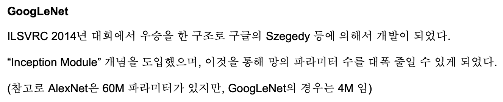

# GoogLeNet

Progress: Done
최종 편집 일시: 2023년 7월 2일 오후 3:45

- network in network 참고 :
    
    [[Part Ⅴ. Best CNN Architecture] 5. GoogLeNet [2] - 라온피플 머신러닝 아카데미 -](https://blog.naver.com/PostView.naver?blogId=laonple&logNo=220692793375&parentCategoryNo=&categoryNo=22&viewDate=&isShowPopularPosts=false&from=postList)
    

- 자세한 논문 리뷰 :
    
    [(GoogLeNet) Going deeper with convolutions 번역 및 추가 설명과 Keras 구현](https://sike6054.github.io/blog/paper/second-post/)
    

# Introduction

- 지난 3년간 딥러닝, 그 중 컨볼루션 네트워크를 사용하는 부분에 많은 발전이 있었음
- 특히 image recognition과 object detection 분야에서 드라마틱한 발전
- 이는 단지 하드웨어나 데이터셋, 큰 모델로 발전한게 아니라, 새로운 아이디어와 알고리즘, 네트워크 아키텍쳐의 발전으로 이뤄진 것
- ILSVRC 2014에 사용된 AlexNet과 비교했을 때, 논문에서 제안하는 GoogLeNet은 12배나 적은 파라미터수를 사용하면서도 더 높은 정확도를 보임
- 이와 같은 발전은 R-CNN 알고리즘과 같은 컴퓨터 비전 분야의 여러 알고리즘과의 시너지를 통해 이뤄낸 성과일 것임.

- 또 다른 주목할만한 점은 모바일, 임베딩 컴퓨팅 분야, 메모리와 파워의 제한으로 인해 효율적 알고리즘이 중요한 분야
- 이 논문은 단순히 정확도의 향상만 생각한 것이 아닌,  임베딩 시스템과 같은곳에 적용하는 것을 고려하였기 때문에 대규모의 데이터셋에서도 어느정도 합리적인 cost로 모델 추론이 가능함
- 이 논문에서는 효율적인  심층 신경망 구조를 가져 컴퓨터 비전 분야에 적용될 수 있는 “Inception”이라 불리는  네트워크에 대해 소개할 것
    
    → 이 이름은 network in network 논문에서 언급된 “we need to go deeper”에서 차용한 것
    
- 논문에서 언급된 “deep”은 두가지 의미를 지님
    1. inception module을 통한 심층 학습
    2. 네트워크 자체의 깊어짐

# Motivation and High Level Considerations

- 심층 신경망의 성능을 높이는 가장 간단하고 효율적인 방법은 사이즈를 키우는 것(깊이, 너비 둘 다)
    
    → 하지만 큰 사이즈라는것은 많은 파라미터 수를 가지게 되기 때문에 쉽게 오버피팅이 발생함
    
    ⇒ 이미지세트가 제한되어있는 경우 추가로 데이터를 만들기가 어렵기 때문에 더욱 쉽게 오버피팅 발생
    
    → 또한 네트워크 사이즈가 크면 컴퓨터 리소스를 많이 잡아먹게 됨
    
    ⇒ 연결되어있는 컨볼루션 필터의 사이즈를 바꾸면 사이즈의 제곱만큼 연산량이 증가,
    
    ⇒ 또한 대부분의 가중치가 0이 되며 비효율적 연산이 발생
    

sparse한 네트워크(좌)와 dense한 네트워크(우)

- 근본적으로 위와 같은 문제를 해결하는 좋은 방법은 convolution과 Fully connected layer에서 만들어지는 dense 한 네트워크를 sparsely 한 네트워크로 바꾸는 것
    
    → Arora에 따르면 만약 데이터셋이 굉장히 크고 sparse 한 deep neural network로 표현된다면, 마지막 레이어의 활성화 정도의 상관관계를 분석해내고 상관성이 높은 출력을 가진 뉴런들끼리 클러스터링하여 레이어별로 최적의 네트워크를 구성할 수 있다고 함
    
    ⇒ 수학적으로 엄격한 증명이 필요한 일이기는 하지만, 뉴런들이 함께 활성화되고 연결된다는 hebbian principle이 좀 덜 엄격한 상황에서도 충분히 잘 작동될 수 있다는 것을 암시해줌
    

- 하지만 오늘날의 컴퓨터는 균일하지 못한(non-uniform), sparse한 데이터를 계산하는데에 있어서 상당히 비효율적
    
    → 연산을 100배 줄인다고 해도 sparse한 데이터를 계산하는데에 있어 발생하는 수많은 오버헤드와 캐시미스가 야기하는 비효율은 너무 강력해서 제대로 연산하지 못하게 됨 
    
    → 또한 dense 한 matrix 계산을 더욱 빠르게 만들어주는 CPU와 GPU의 발전과 다양한 라이브러리의 등장 때문에 sparse한 matrix를 계산하는 비효율성은 더욱 증가하고 있음
    
    ⇒ 이처럼 sparse한 matrix를 다루는 것은 엔지니어링적으로나 컴퓨터의 구조적으로나 상당히 어려운 일
    

- 컴퓨터 비전에서는 이미지 공간 영역에서의 희소성(sparsity)을 활용하기 위해 convolution 을 사용함
    
    → convolution 역시 이전 feature map의 patch와 dense한 연결로 이뤄져있음
    
    → ConvNet이 이러한 convolution의 단점을 부수기 위해 random 하면서도 sparse 한 table을 사용하기도 했음
    
    ⇒ 하지만 대세는 다시 convolution으로 돌아와버림, 그리고 이후로 추세는 계속 병렬 컴퓨팅을 통해 dense한 matrix를 더욱 잘 처리하는 쪽으로 발전해나감
    
    ⇒ 배치사이즈의 증가와, 큰 사이즈의 필터들을 사용할 수 있게 해주는 병렬 컴퓨팅이 주요 추세가 됨
    

- 그렇다면, 현재 가용한 컴퓨터 성능 수준에서, 모델이 Sparsity의 이점을 이용할 수 있게 만든다면 어떨까?
    
    → 여러 논문들을 참고하여 sparse 한 네트워크를 클러스터링을 통해 dense한 matrix로 만들어 계산하는것이 좋은 성능을 내는것을 확인
    
    → 논문에서 제안한 Inception은 Arora et al.의 sparse network를 사용 가능한 component로 구현하여 Arora et al.의 가설을 따라 가는지 보고자 하는 case study로 시작됨
    
    ⇒ “sparse한 매트릭스를 clustering하여 dense하게 만들고 계산하는것이 가능한 것인가?”
    

- 2번의 iteration만에 Network in Network를 뛰어넘는 성능을 달성
    
    → 이후 learning rate, hyperparameter, training methology를 조정하여 object detection, localization 에서 좋은 성능을 달성해냄
    

# Architectural Details

- Inception architecture의 주요 아이디어는 computer vision을 위한 convolutional network의
    1. optimal local sparse structure 근사화
    2. 쉽게 이용 가능한 dense component 구성
    
    을 위한 방법을 고려한다.
    
    → **Sparse 매트릭스를 서로 묶어 (클러스터링 하여) 상대적으로 Dense 한 Submatrix를 만든다는 것**
    

- Translation invariant를 가정하고, convolutional building block으로 네트워크를 만들 것. 이를 위해 필요한 것은 optimal local construction을 찾고, 이를 공간적으로 반복하는 것
    
    → Translation invariant : 이미지 내의 어떤 특징이 평행 이동 되더라도 활성화 여부가 달라지지 않는 성질
    
- Arora의 연구는 마지막 layer의 correlation statistics를 분석하여, high correlation unit의 그룹으로 clustering하는 방식의 layer-by-layer construction을 제안함
    
    → Clustered unit은 다음 layer의 unit으로 구성되고, 이전 layer의 unit에 연결 된다.
    
- 이 논문에서는 이전 layer의 각 unit이 입력 이미지의 일부 영역에 해당하며, 이러한 unit들이 filter bank로 그룹화 된다고 가정한다. 이에 따라 lower layer에서는 correlated unit들이 local region에 집중 될 것이다. 즉, 한 영역에 많은 cluster가 집중 될 것이며, 이는 NIN에서 제안 된 것처럼 다음 layer에서의 1x1 conv layer로 수행될 수 있다.
    
    → 큰 patch size의 convolution을 사용함으로써, 적은 수의 cluster로도 더 넓게 펼쳐질 수 있으며, 이를 통해 patch의 수가 감소될 수도 있다. Patch는 filter로 생각하면 된다.
    
- 또한, patch-alignment issus를 피하기 위해, 현재의 Inception architecture에서 filter size를 1x1, 3x3 및 5x5로 제한한다. 이는 필요성보다는 편의성에 더 중점을 둔 결정이다.
    
    → Filter size가 짝수일 경우에는 patch의 중심을 어디로 해야 할지도 정해야하는데, 이를 두고 patch-alignment issue라고 한다.
    

- 즉, 제안 된 구조는 이러한 layer들의 output filter bank 조합이라는 것을 의미한다.
    
    → 이는 다음 layer의 입력으로 연결 될 single output vector가 된다.
    

- 또한, 현재의 성공적인 convolutional network들에서 pooling 연산이 필수적이었단 사실은, Fig.2와 같이 각 단계에서 alternative parallel pooling path를 추가하는 것이 이점을 가질 것임을 암시한다.
    
    
    

- 하지만 위 이미지로 제시된 naive한 버전의 인셉션 모듈은 큰 문제가 있는데, 5*5 convolution의 cost가 너무 커서 layer를 지날수록 점점 더 파라미터가 커지게 될 것이라는 점
    
    → 이를 해결하기 위해
    

- 이를 해결하기 위해 논문의 모델 구조에 2번째 아이디어인 차원축소를 적용함
    
    → 저차원의 embedding 도 큰 이미지 패치의 많은 정보를 가지고 있을 수 있기 때문
    
    → 때문에 1*1 layer를  3*3 연산과 5*5 연산의 앞단에 도입해 연산량을 줄이고, 활성화함수를 통한 비선형적 특성의 증가를 노림
    

- 이 모듈을 사용함으로서 얻는 특징
    1. 폭발적인 계산량 증가를 피할 수 있음(차원축소의 효과)
    2. 시각 이미지 정보를 다양한 스케일에서 처리함(1 / 3 / 5 size로 바라봄)
        
        → 다양한 스케일로 처리되는 만큼 다양한 크기를 가지는 여러 특징을 동시에 추상화해나갈 수 있음
        
    

# GoogLeNet

- Yann Lecun의 LeNet에서 이름을 차용
- 인셉션 모듈을 활용하였고, 이후 앙상블을 통해 약간의 성능 증가를 확인함

- 위 모델은 계산 효율성을 고려하고 만들어졌기 때문에 low memory를 사용하고, 제한된 리소스 환경에서도 잘 작동되게끔 만들어짐

- 인셉션 모듈을 포함하여 모든 컨볼루션 과정을 거친 뒤에는 ReLU 활성화 함수를 사용
- 224 * 224 size의 RGB mean 정규화를 거친 이미지를 input으로 받음
- 학습하는 파라미터는 총 22개 레이어, 총 레이어는 27개, 인셉션 모듈의 층을 각자 셀 경우 100개 이상의 층을 가지는 구조

- linear 층을 통과하기 전 avg pooling을 하는 것은 NiN 논문을 참고함.
    
    → NiN와는 다르게 네트워크 끝에 linear 층을 두었다는 것이 NiN과의 차이점
    
    ⇒ linear를 사용하면 다른 레이블셋을 가진 데이터에 적용시키기 쉽기 때문에 두었고, 특별히 의미를 두지는 않음
    

- Fully connected 대신 avg pooling을 사용해 0.6%의 성능 향상을 보임
    
    → 그럼에도 불구하고 dropout을 쓰는것은 성능 향상에 매우 중요했음
    

- 네트워크의 깊이가 깊어질수록 layer 간 gradient를 효과적으로 전달하는것이 매우 중요함
    
    → shallow network가 deep network보다 성능이 좋을 수 있다는것이 그 증거
    
    ⇒ 층이 깊을수록 중간 layer의 gradient가 끝층까지 잘 전달될 수 있게 해줘야함
    

- 학습 과정에서 네트워크의 중간에 보조 분류기(auxiliary classifier)를 두어 gradient가 잘 전달되게 해줌
    
    → 추가적으로 regularization 효과와 함께 vanishing gradient problem를 해결
    

