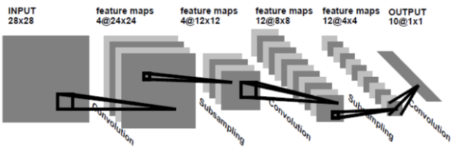

# LeNet

Progress: Done
Tags: CNN, Done
최종 편집 일시: 2022년 11월 13일 오후 8:47

[https://velog.io/@lighthouse97/LeNet-5의-이해](https://velog.io/@lighthouse97/LeNet-5%EC%9D%98-%EC%9D%B4%ED%95%B4)

[https://blog.naver.com/laonple/220648539191](https://blog.naver.com/laonple/220648539191)

[https://velog.io/@lighthouse97/LeNet-5의-이해](https://velog.io/@lighthouse97/LeNet-5%EC%9D%98-%EC%9D%B4%ED%95%B4)

[https://github.com/Seonghoon-Yu/AI_Paper_Review/blob/master/Classification/LeNet_5(1998).ipynb](https://github.com/Seonghoon-Yu/AI_Paper_Review/blob/master/Classification/LeNet_5(1998).ipynb)

[https://github.com/Chan1223/kyu-chan-park/blob/main/개인공부/CNN 구현/LeNet.ipynb](https://github.com/Chan1223/kyu-chan-park/blob/main/%EA%B0%9C%EC%9D%B8%EA%B3%B5%EB%B6%80/CNN%20%EA%B5%AC%ED%98%84/LeNet.ipynb)

- LeNet 발표 전 활용되던 Fully connected network는 2차원 이미지를 1차원적으로 펼친 데이터를 입력받음
    
    → 이미지가 같는 공간적인 정보(Topology)가 손실되는 문제가 있었음
    
- Yann LeCun은 Local receptive field, Shared weight, Sub-sampling(pooling)의 개념을 결합해 이 문제를 해결하려 함

### LeNet-1

- Convolutiotional layer + Pooloing layer를 반복하며 전역적으로 의미있는 특징을 찾아내는 현대 CNN의 기본적인 형태 구조를 가짐

- 주요 특징
    1. Local receptive field의 개념을 활용하기 위해 5x5 convolutional layer로 feature map 을 생성
    2. 전체 이미지가 같은 weight와 bias로 설정된 convolutional kernel 사용
        
        → shared weight 개념 적용
        
    3. Average Pooling layer로 subsampling 적용

- Image를 16*16으로 줄이고 28*28 size의 중간에 위치시킴

### LeNet-5

- LeNet-1 의 구조를 발전시킨 모델, 입력 이미지 크기, feature-map의 개수 및 fully-connected layer의 크기에 변화가 있음
- 3개의 Convolutional, 2개의 subsampling layer, 1개의 fully-connected layer

- input layer
    - 32*32 size를 input으로 받음
- Layer C1
    
    
    
    → 5*5 filter 6개로 convolutional
    
    → 28*28*6 size feature map 생성
    
    → parameter :  26개(25+편향 1개)의 파라미터 * 커널 6개 = 156 
    
- Layer S2
    
    
    
    → 2*2 size Subsampling(Average pooling, overlapping X)
    
    → 14*14*6 feature map 생성
    
    → sigmoid 함수 사용
    
    → parameter : (weight + bias) * filter = (1 + 1) * 6 = 12
    

- Layer C3
    
    
    
    -> 5*5 size filter를 다시 한번 적용해 16개의 feature map 생성
    
    
    
    → 6개였던 feature map을 위의 사진과 같이 연결시켜 총 16개의 feature map을 생성
    
    ⇒ 네트워크의 선택적 연결을 통해 symmetry한 성질이 없어지길 기대
    
    ⇒ convolution 된 low-level의 feature가 서로 다른 부분들과 혼합되면서 최종적으로 좀 더 global한 feature가 얻어지길 기대함
    
    
    
    → parameter : (5 * 5 * 6* 10) + (1*16) = 1516
    
    ⇒ 60은 위 사진에서 connection 된 개수
    
- Layer S4
    
    → 2*2 size Subsampling(Average pooling, overlapping X)
    
    → 10*10*16 → 5*5*16 으로 변함
    
    → parameter : (weight + bias) * 필터수 = (1+1) * 16 = 32
    

- Layer C5
    
    → input data size = 5*5*16
    
    → 5*5 filter 120개로 convolution
    
    → 1*1*120 의 feature map 생성
    
    → parameter : (5*5*이전 feature map 개수) * 전달되는 feature 수 + bias = (5*5*16)*120 + 120 = 48120
    

- Layer 6
    
    → input data size = 1*1*120
    
    → 120개의 feature map이 서로 섞여 84 개의 unit에 연결됨
    
    → parameter = (120 * 84) + 84 = 10164
    

- Layer 7
    
    → input data size = 1*1*84
    
    → 84개의 feature map이 10개의 Euclidean radial basis function(RBF) 유닛들에 연결됨
    
    → 10개의 출력에서 각각이 특정 이미지일 확률을 나타냄
    
    → parametr = (84 * 10 ) + 1 * 10 = 850
    

⇒ 지금까지 언급된 파라미터를 모두 합치면

C1 + S2 + C3 + S4 + C5 + F6 

= 156 + 12 + 1516 + 32 + 48120 + 10164 + 850

= 600850개

- Alexnet과의 비교

