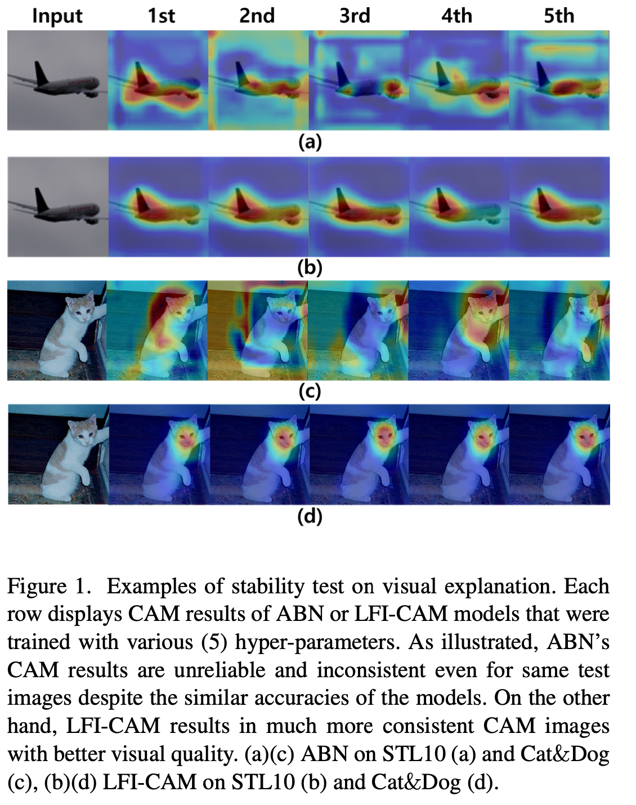

# Lfi-CAM

Progress: Done
URL: https://arxiv.org/abs/2105.00937
최종 편집 일시: 2023년 8월 8일 오후 8:22

[LFI-CAM: Learning Feature Importance for Better Visual Explanation](https://arxiv.org/abs/2105.00937)

- CNN이 다양한 vision task에 사용되면서 모델의 결정과 예측에 대한 해석이 필요해짐
    
    → 대부분의 뉴럴 네트워크는 많은 파라미터와 비선형 함수의 적용으로 인해 블랙박스로 여겨짐
    
    → accuracy, precision 등 다양한 metric이 사용되지만 잘못되는 경우도 존재함
    
    → 때문에 모델의 신뢰성을 높이기 위해서는 사람이 믿을수 있을만한 모델이 필요함
    

- 이를 위한 여러가지 연구가 존재하며 4가지의 카테고리로 나눌 수 있음

1. response base : 네트워크 일부 층을 GAP으로 대체한 CAM이 여기에 해당. 원본 네트워크의 일부 층을 대체하고 새로 학습하다보니 분류 정확도가 감소하는 단점 존재

1. gradient base : Grad-CAM은 gradient base  기법으로 GAP을 사용하는 CAM의 단점을 극복한 모델, 미분을 활용해 그래디언트를 계산하는 방식. 하지만 이미지 내 동일 클래스가 여러개 존재할 경우 단점이 존재. Grad-CAM++ 는 Grad-CAM 단점을 해결하기 위해 (+) 상태의 그래디언트의 가중 평균을 잡아내는 방식. 두 모델 모두 inference 과정에서 추가적인 역전파 단계를 필요로 함

1. perturbation base: LIME은 입력에 perturbation을 적용하여 실제 레이블을 근사화할 때 가장 높은 양의 가중치를 갖는 설명으로 이미지 영역을 제시하는 국부 가중치 선형 회귀 모델을 학습. 모델에 구애받지 않고 간단하지만 추가적인 정규화가 필요하고 시간이 많이 소요됨.  RISE는 마스크를 무작위로 샘플링하여 사전 예측 점수로 입력 이미지 영역의 중요성을 추정.

1. hybrid base : 하이브리드 기반. Score-CAM 은 perturbation과 response 기반 모델의 혼합. attention map을 원본 이미지의 마스크로 사용하고,  대상 클래스에 대한 forward 점수를 얻은 다음, 점수 기반 가중치와 attention 맵의 가중 합으로 집계
    
    → 기울기 기반 방법에 비해 높은 정확도와 안정적인 결과를 달성하지만, Score-CAM은 CAM을 얻기 위해 필요한 특징 맵의 수만큼 많은 inference를 필요로 하는 만큼 매우 느리고 시간이 많이 소요됨. 
    
    ABN(attention Based Network)는 attention 메커니즘과 response 모델을 사용하는 하이브리드 모델.  
    
    → attention loss와 perception loss를 결합한 방식의 loss를 사용하여 최적화, 단점으로는 결과가 불안정할 수 있고 하이퍼파라미터를 잘못 세팅할 경우 sub-optimal에 빠질 수 있음
    

- ABN과 Score-CAM에 기초하여,  ABN과 유사한 네트워크 구조를 가지는 LFI-CAM 을 제안
    
    → 하지만 어텐션 맵을 만들어내는 과정은 original CAM 방법과 유사하다 볼 수 있음
    
    → LFI-CAM 의 attention branch는 feature map을 mask로 취급하고, score cam과 유사한 방식으로 attention map을 생성해내기 위해  각 feature map에 대한 feature importance score를 가짐
    

- score cam과 다르게, LFI cam의 attention branch 안에 있는 feature importance network(FIN)은 각 피처맵의 feature importance를 학습함
    
    → LFI CAM의 attention map은 forward 과정에서는 score cam의 attentnion map 생성보다 빠름
    

- LFI CAM 은 attention branch, perception brach 2파트로 구성됨
    
    → Attention branch는 LFI cam에서 매우 중요한 역할, feature importance를 학습하여 attention map을 통해 시각화를 가능하게 만들어주고, attention 매커니즘을 사용하여 분류 성능을 개선시키기 때문
    
    → perception branch는 feature map을 추출하고, feature map과 attention map을 활용하여 class 예측을 진행함.
    
    → LFI-CAM은 end-to-end 방식으로 이미지 분류 및 시각적 설명을 위해 훈련 가능, ABN보다 더 작은 네트워크 매개 변수로 더 안정적이고 일관된 attention map을 출력함.
    

- 논문의 novelty
    1. 새로운 아키텍처(LFI-CAM) 제안
    2. LFI CAM은 직관적이고, 이해 가능한 방법을 활용하여 attention map의 feature importance 를 배우고, forward 과정에서 어텐션 매커니즘을 사용해 향상된 분류 성능을 내는 동시에 항상 일관된 attention map을 생성함
    3. gradient-free한 방법으로서, perturbation 방법과 CAM 방식 사이의 갭을 매우고, Score CAM보다 좀 더 향상된 속도로 추론함
    4. 모델 아키텍처에 민감하지 않으며, Resnet, Densenet, ResNeXt, SENet과 같은 베이스라인 모델에 쉽게 적용 가능

# 선행연구

## Attention Branch Network(ABN)

- ABN은 추론 과정에서 어텐션 매커니즘을 적용하여 향상된 분류 성능과 향상된 attention map을 만들어내고자 제안됨
    
    → feature extractor로 구성됨(attention branch와 perception) 
    
    → 어텐션 맵을 만들어내기 위해 1*1 conv를 통과한 뒤  K*h*w로 구성된 feature map 생성
    
    => k는 데이터에 있는 카테고리 수이자 channel 수, h w는 이미지 가로세로
    
    → 여러 feature map을 1*1 conv 넷을 통해 다시한번 하나의 feature map으로 합쳐줌(1*h*w)
    
    → 마지막으로 sigmoid function을 활용하여 feature map을 normalize 함
    

- 논문의 저자들은 Cat&Dog dataset으로 다양한 하이퍼파라미터로 실험했을 때 ABN이 신뢰하기 어렵고 inconsistent 한 attention map이 나온다는것을 확인함
    
    
    
- ABN의 CAM 결과는 동일한 정확도일때도 다양한 feature map을 그려내기에 신뢰하기 어려움

- ABN의 단점은 2가지 이유로 인해 이런 현상이 발생한다고 보았는데
    
    → 데이터셋의 카테고리 K가 적으면 attention branch가 생성해내는 K 채널 feature map은 매우 얕기 때문에 attention map의 품질을 저하시키고, 일관되지 못한 결과를 만듦
    
    → ABN의 attention branch는 채널별 feature importance를 고려하지 않고, 하나의 feature map으로 합쳐버림. 그리고 어텐션 매커니즘을 사용하긴 하지만 다양한 하이퍼파라미터와 초기값에 따라 값이 달라져버림
    

## Score-CAM

- Score-CAM은 각 feature map에 대해 단순하면서 효율적인 importance representation을 가지는 CAM에 기반한 논문
- 이전 gradient를 시각화하는 grad-cam, grad-cam++와 같은 기법과는 달리 score cam은 gradient에 대한 의존성을 제거함
    
    → 목표 클래스에 대한 foward 과정에서 생성된 각 feature map의 weight를 사용
    
    → 최종 attention map은 feature map들의 weighted sum 값을 가지게 됨
    
    → Score CAM에서 클래스별로 나뉘는 attention map을 얻기 위해, 각 feature map은 원래 input size로 upsampling된 뒤, 0 ~ 1 사이로 정규화됨
    
    → feature map에서 강조된 공간을 원래 input size에 projection하기 위해서 original input I에 element-wise로 attention map score를 곱하여 Mask를 얻어냄
    
    
    
    → 여기서 구해지는 M은 마지막 conv 층의 채널 개수와 동일함
    
    
    
    → 얻어진 mask M에 foward 과정을 거친 뒤, softmax를 통해 score Sk를 얻어냄
    
    → 각 목표 클래스 c에 대한 score 점수 S는 k 번째 feature map이 얼마나 중요한지를 표현하는 점수이고, w 로 다시 쓰여짐
    
    
    
    → 마지막 class activation map은 모든 feature map과 weight가 곱해진 combination 값에 RELU를 사용하여 산출됨
    
    
    
    → Score CAM이 그래디언트 기반 접근법과 비교했을 때 훨씬 적은 노이즈와 안정성을 가지기에 좀 더 좋은 시각 성능을 보이지만, 여러번의 forward 과정을 거쳐야 하기 때문에 매우 느림
    

# 3. Proposed Method

- End-to-End 학습 방법을 통해 image classification과 visualization을 동시에 달성 가능한 LFI-CAM을 제안
    
    → attention branch와 perception branch로 구성됨
    
    → perception branch는 input image로 부터 feature map을 생성해냄
    
    ⇒ 여러 conv layer를 통과하고 나온 feature map과 attention map을 활용하여 class를 예측함
    
    → downscaling & grayscaling 된 input image는 attention brach 안에 있는 Feature importance Network(FIN)으로 들어감
    
    → FIN은 각 feature map의 feature importance를 추출한 뒤, feature map과 feature importance를 가중합하여 attention map을 생성해냄
    
    ⇒ 이 과정에서 attention branch는 feature importance를 학습하여 이미지 시각화를 위한 attention map을 생성해내고, 생성된 attention map은 attention 매커니즘을 통해 classification 성능을 향상시키기 위해 사용됨 
    

### 3.1 Motivation

- 논문에서는 ABN과 ScoreCAM에서 영감을 받은 새로운 아키텍처 LFI-CAM을 제안함
    
    → ABN처럼 attention 매커니즘을 통해 classification 성능을 향상
    
    ⇒ 하지만 ABN의 attention branch는 앞서 설명한것처럼 신뢰하기 어려운 visualization을 만들어내기도 함
    
    → 이 문제를 해결하기 위해 LFI CAM의 attention branch는 feature map을 마치 마스크처럼 취급하고, 각 feature map의 feature importance 정보를 사용하여 score-cam과 유사한 방식으로 attention map을 생성함
    
    → LFI cam의 attention branch에 들어있는 feature importance 네트워크는 score cam과 같이 훈련 과정에서 각 feature map의 feature importance를 학습함
    
    ⇒ 하지만 우리 모델의 attention map이 forward 과정에서 훨씬 빨리 생성됨
    

### 3.2 feature importance network(Attention branch)

- attention branch에서 class activation map을 직접 학습해내는 기존 방법론들과는 다르게, 논문에서는 ABN의 attention branch 를 새로운 네트워크로 대체함
    
    → 이 부분을 Feature Importance Network(FIN)이라 부름
    
    → LIF-CAM 모델이 feature importance 를 좀더 잘 학습하여 더 나은 class activation map을 만들게 도와줌
    
    ⇒ class activation map은 conv layer의 마지막 층이 내뿜는 feature map과 학습된 importance vector의 가중합으로 만들어짐
    

- feature importance를 학습하기 위해 FIN은 Score-CAM과 유사한 방법 사용함
    
    → 하지만 score cam과는 다르게 original input을 gray scale로 변환함
    
    ⇒ feature map과 size를 맞춰주기 위해 down scaling도 함께 진행
    
    → 또한 여러 forward computing을 피하기 위해 concat된 mask 이미지가 FIN에 input됨
    
    ⇒ 각 feature map으로부터 계산된 feature importance가 FIN의 출력물이 됨
    

- LFI-CAM의 class activation map을 얻어내기 위해 RGB 컬러를 갖는 최초 input(3*w*h)는 gray scaling 됨, 이후 feautre map과 동일 사이즈를 맞춰주기 위해 down sampling이 이뤄짐
    
    → Resnet 기준으로는 3*224*224 가 1*14*14가 됨
    
    
    
- 마지막 conv layer를 타고 나온 K개의 feature map F은 0~1 사이로 정규화(s)되고, gray scaling &down sampling된 input 이미지와 곱해져 mask image를 만들게 됨

- 생성된 마스크 이미지 M은 feature map과 동일한 n개의 개수가 되고, 이 마스크 이미지들은 전부 하나로 concat됨
    
    → 이후 concat된 이미지 M은 FIN 모델에 입력되어 forward 과정에서 feature importance score를 만들어냄
    

- S 는 feature score vector이고 k번째 S는 k번째 feature map의 score가 됨

- 모든 feature map에 score를 곱한 가중 합에 negative influence를 제거하기 위해 RELU를 씌운 것이 class activation map이 됨!
    
    
    

### 3.3 Perception branch

- Perception branch는 원래 이미지를 입력으로 받아 각 클래스의 최종 확률을 출력
    
    → FIN 에서 생성된 attention map은 feature map과 더해져 attention 매커니즘에 의해 계산됨
    
    → ABN과 달리 LFI-CAM의 attention map은 conv layer의 마지막 층으로부터 생성됨
    
    ⇒ 하지만 어텐션 매커니즘은  모든 feature map에 적용시킬 수 있음
    
    → attention 매커니즘은 ABN과 같은 formula를 사용함
    
    
    
    → Fk는 l번째 layer를 통과하고 나온 Feature map, F prime k는 attention 매커니즘을 타고 나온 결과
    
    → attention 매커니즘은 attention map 주변의 영역이 0으로 떨어지는 것을 방지해주면서 attention 값이 높은 곳에서 feature map을 강조해 feature map의 분류 성능을 향상시키는데 도움이 됨