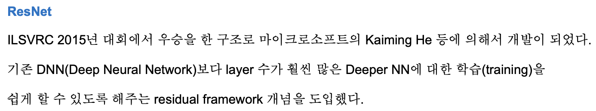

# ResNet

Progress: Done
URL: https://arxiv.org/abs/1512.03385
논문 출판일: 2015년 12월 10일
리뷰 시작 날짜: 2023년 7월 9일
최종 편집 일시: 2023년 7월 9일 오후 8:03

[Deep Residual Learning for Image Recognition](https://arxiv.org/abs/1512.03385)

# Abstract

- 심층신경망을 학습시키는것은 어려움
    
    → “잔차학습(residual learning)”이란 개념을 통해 기존에 제시된 네트워크보다 깊은 심층 네트워크를 잘 학습시키는 방법을 제안
    
    → layer 의 input을 수정하여 잔차를 학습할 수 있는 잔차 함수를 만들어냄
    
    → 잔차 학습을 통해 더 쉽게 최적화가 이뤄지고, 층의 증가에 따른 정확도의 향상을 확인할 수 있었음
    

- VGG net에 비해 8배나 깊은 152층을 쌓았음에도 훨씬 가벼운 파라미터 수를 유지하면서 앙상블을 통해 3.57%의  에러율을 달성함
    
    → 2015 imagenet 경진대회 우승
    
    → imagenet, COCO detection, localization, segmentation에서 모두 좋은 성능을 얻음
    

# 1. Introduction

- Deep CNN은 image 분류에서 매우 좋은 성능을 얻음
    
    → 저 / 중 / 고 수준의 feature를 end-to-end 기법으로 합쳐주며,  여러 레이어(층)을 쌓음을 통해 풍부한 feature를 얻어냄
    
- imagenet challenge의 결과로 확인하건데 very deep 한 모델들이 좋은 성능을 내는 것을 확인함
- 네트워크에 있어 depth가 중요하다는 것은 다음 질문을 떠오르게 만듦
    
    → “더 많은 층을 쌓는 것이 더 좋은 네트워크임을 보장하는가?”
    
    → 층이 깊어질수록 vanishing/exploding gardients problem이 많이 발생함
    
    → 하지만 이러한 문제들은 normalized initialization과 intermediate normalization layers(batch normalization)에 의해 어느정도 해결되었음
    

- 네트워크가 깊어질수록, 성능 저하 문제가 발견됨
    
    → 층이 깊어지는데 오히려 정확도가 떨어지고, 성능 저하가 빠르게 발생함
    
    → 층이 많아질수록 training error 또한 더욱 증가하기 때문에 overfitting의 문제는 아님
    
    
    

- training accuracy의 성능 저하 문제는 모든 시스템들이 쉽게 최적화시킬 수 있는게 아니라는것을 보여줌
    
    → 얕은 층을 먼저 학습 시킨 뒤 깊은 층 구조에 parameter를 복사하는 identity mapping을 통해 해결할 수 있지 않을까?
    
    ⇒ 실험결과 좋은 성능을 내지 못함
    

- 때문에 이 논문에서는 “deep residual learing” framework를 제안하여 성능 저하 문제를 해결하고자 함
    
    → 네트워크에 들어있는 각각의 레이어들이 모두 정답값을 가르키게 하기 보다는, 각각의 레이어가 정답값과 얼마만큼의 차이를 가르치고 있는지 “잔차”를 배우게 함
    
    → 기존의 네트워크들이 찾고자 하는 정답값이 $x = H(x)$라고 할 때, 논문에서 제안하는 네트워크 구조는 $F(x) = H(x) - x$를 배우고자 함
    
    ⇒ $H(x) = F(x) + x$로 다시 쓰일 수 있음
    
    → 잔차 매핑 방식이 기존의 identity 매핑 방식보다 학습이 용이하다는 가정을 한 뒤, $F(x)$를 0에 가까이 만들어 결론적으로 $H(x) = x$가 되게끔 만들려는 것.
    
    → $F(x)$가 특정 값이 있는것이 아니라 모두 0을 맞추는 것이기 때문에 상대적으로 학습이 쉬울것이란 가정
    
    
    
- $F(x)+x$는 순전파 과정에서 “shortcut connections”의 모양으로 표현될 수 있음
    
    → input x를 output 에 그대로 더해줌
    
    → 이러한 구조의 shortcut connection은 추가적인 파라미터 학습이 필요하지 않기 때문에 computational complexity를 증가시키지 않음
    
    → 네트워크는 end-to-end 방식으로 SGD backpropagation으로 학습될 수 있음
    
    ⇒ 결론적으로 기존의 네트워크와 유사한 구조에 단순한 아이디어를 추가했을 뿐이라는 뜻
    

- 논문에서 Imagenet dataset에 실험을 거쳐,
    
    1) resnet 구조가 기존 다른 네트워크에 비해  훨씬 최적화가 잘 이뤄지며 높은 성능을 달성했고
    
    2) depth의 증가로 높은 정확도의 증가를 불러일으킴을 시사함
    

- CIFAR 10 데이터셋의 실험결과도 함께 제안하며 이는 단순히 특정 이미지셋에 최적화된 결과가 아닌, 범용적으로 적용될 수 있는 네트워크 구조임을 보여줌

- 거기에 100 레이어, 심지어는 1000 레이어 구조까지 실험을 거침
    
    → 최종적으로 152 layer 를 가지는 ResNet 구조를 사용하여 VGG net보다 단순하면서도 높은 성능을 기록함
    
    → 앙상블 기법을 활용하여 top-5 error rate에서 3.57%를 달성하고, ILSVRC 2015 classification에서 1위를 달성함
    

# 2. Related Work

### **Residual Representation**

- image recognition에서 VLAD는 residual vector를 활용해 encoding 하는 방식, Fisher Vector는 VLAD의 확률적 개념을 가미한 버전
    
    → 두 모델 모두 image retrieval 과 classification에서 좋은 성능을 내는 얕은 구조의 representation 방법
    
    → 특히 vector를 quantization하는 방법에 있어서는 residual vector를 양자화 하는 것이 original vector를 양자화시키는것보다 훨씬 효과적인 편 
    
- Low-level의 비전과 그래픽스 분야에서 편미분 방정식을 풀기 위해 여러 개의 Scale로 Subproblems를 재구성하는 Multigrid Method를 사용하였다. 여러 스케일을 잇기 위해 Residual Vector를 사용함
    
    → good reformulation이나 preconditioning은 optimization을 간소화할 수 있음
    

### **Shortcut Connection**

- shortcut connection은 과거부터 많이 연구되어온 방식
    
    → 과거 MLP를 훈련시킬때 몇몇 layer와 output을 바로 연결하는 auxiliary cliassfier를 사용하기도 함(vanishing / exploding gradients 회피 목적)
    
    ⇒ Inception net에서도 사용한 방식이기도 함
    

- 유사한 연구 방법에는 highway networks가 있음
    
    → gating function이 있는 short cut을 제안, data dependent 하며, 학습을 위한 parameter를 가지고 있음
    
    ⇒ resnet은 parameter-free하며 data dependent 하지 않음
    
    → gated shorcut이 닫히면(0에 근접하면) non-residual 한 function으로 바뀜
    
    ⇒ resnet은 오직 residual function만 사용한것이 대조적, connection이 닫히거나 하는 일도 없음
    
    → highway network는 depth 증가에 따른 성능 향상을 보여주지 못한 것도 resnet과 대조적
    

# 3. Deep Residual learning

## 3.1 Residual learning

- $H(x)$가 몇개의 layer에 대한 underlying mapping이라 간주
    
    →x 가 input될 때, 여러 비선형 레이어를 사용하면 복잡한 함수를 점근적으로 근사할 수 있음
    
    → input에서 여러 비선형함수를 반복적으로 사용하면 복잡한 함수가 되어 정답을 맞출 수 있게 된다는 뜻
    
    → 비선형함수가 적용된 값 - input 을 하게 되면 비선형 함수의 사용으로 만들어지는 값의 차이를 알 수 있게 됨($F(x)$)
    
     ⇒residual function($F(x)$)을 얻어낼 수 있다(근사할 수 있다)는 뜻
    
    ⇒ 결론적으로, input과 output이 동일한 차원에 있다고 할 때, $F(x) = H(x)-x$ 를 구할 수 있음
    

- 이러한 함수의 재구성 방식은 degradation problem을 해결하기 위해 만들어낸 것
    
    → intro에서 다뤘듯 층을 쌓는다는 것이 identity mappings를 만들어나가는 과정이라면, 층을 증가시키면 얕은 층에 비해 훨씬 더 잘 학습이 이뤄져야만 함
    
    → 하지만 degradation problem이 발생한다는 것은 여러 비선형 함수를 사용한 깊은 네트워크가 identity mapping을 근사하는데 어려움을 겪고 있다는 것을 시사함
    
    → 때문에 identity mapping이 optimal하다는 가정을 가지고, residual learning 방식으로 reformulation을 해줌으로서 네트워크가 identity mapping을 찾아가는 과정을 좀 더 단순하게 만들어 줄 수 있을 것이라 기대함
    

- 현실적으로 identity mapping이 optimal 하지 않다고 하더라도, reformulation이 문제를 preconditioning하는데 도움은 될 수 있을 것.
    
    → 만약 optimal function이 zero mapping보다 identity mapping에 더 가깝다면, solver가 identity mapping을 참조하여 작은 변화 F(x)를 학습하는 것이 새로운 function을 생으로 학습하는 것보다 쉬울 것
    
    → 실험에서는 학습된 residual function에서 일반적으로 작은 반응이 있다는 결과를 보여준다(Fig.7 참조). 
    
    ⇒ identity mapping이 합리적인 preconditioning을 제공함을 증명
    
    ⇒ reformulation은 일종의 guide 역할을 통해 좀 더 잘 학습이 이루어지게끔은 해줄 것이란 기대
    

## 3.2 identity mapping by shortcuts

- 수식적으로 residual block은 아래와 같이 정의될 수 있음

$$
y = F(x, \{W_i\})+x.\\
x : input \\
y : output\\
F(x, \{W_i\}) : residual~mapping
$$

- $F(x)+x$ 연산은 elemet wise addition 연산으로 수행됨
    
    → 차원적으로 동일해야함
    
    → 하지만 만약 차원적으로 동일하지 않다고 해도 아래와 같이 식에 $W_s$를 곱해줌을 통해 x 를 linear projection 시켜 차원을 맞출 수 있음
    
    $$
    y=F(x,\{W_i\}) + W_sx.
    $$
    

## 3.3 Network Architectures

- plain / residual 로 나누어 여러  네트워크를 실험해본 결과, 일관된 결과를 관찰할 수 있었음

### Plain Network

- plain model은 WGG net에 기초함(총 34개의 layer)
    
    → conv layer는 3*3 filter를 사용
    
    1) 같은 feature map size 구현을 위해 동일한 필터 수 사용
    
    2) feature map size가 절반이 되면, 채널이 2배되면서 연산 복잡도가 동일하게 유지
    
- stride=2인 conv 를 사용하여 downsampling 진행
- 마지막에 avg pooling을 통해 1000개의 fc layer와 연결되고 softmax를 거침
- VGG Net보다 적은 수의 필터와 복잡도를 지님
    
    → 34층 baseline model은 36억 FLOPs로 VGG19보다 18% 적은 수의 연산을 가짐
    

### Residual Network

- residual version을 만들기 위해 Base가 되는 plain model에 shortcut connection 모델을 추가
- input과 output이 동일한 차원을 가진 경우에는 residual block 을 바로 적용(굵은선)
    
    → 차원이 증가할 경우(점선) 2가지 옵션을 고려함
    
    a) 추가 차원에는 0 패딩된 차원을 사용(추가 파라미터 증가 X)
    
    b) projection 된 shortcut 사용(1*1 conv 활용하여 차원 맞추기)
    
    ⇒ shortcut connection이 다른 크기의 feature map 간에 mapping될 경우, 두 옵션 모두 strides를 2로 수행
    

## 3.4 Implementation

- Alexnet과 VGG 논문에서 사용된 증강 방식을 사용
    
    → ramdom하게 256, 480 size로 scale augmentation 후 224*244 random crop
    
    → horizontal flip with per-pixel mean subtracted
    
    → standard color augmentation
    
- Batch Normalizatino 사용
    
    → convolution 다음과, 활성화함수 이전마다 사용
    
- 학습
    - SGD optimizer, learning rate 0.1, 10 epoch 마다 decay는 0.0001, momentum은 0.9
    - mini-batch size는 256, iteration은 총 600,000회 수행
    - dropout 미사용
- 테스트
    - 비교를 위해 [AlexNet](https://papers.nips.cc/paper/4824-imagenet-classification-with-deep-convolutional-neural-networks.pdf)의 standard 10-crop test를 수행했다. 최상의 결과를 내기 위해, [VGG](https://arxiv.org/pdf/1502.03167.pdf)와 [He initialization](https://arxiv.org/pdf/1502.01852.pdf)에서 사용한 fully-convolutional form을 적용했으며, multiple scale에 대한 score를 평균했다.
    
    > fully-convolutional form은 정적인 크기를 가지는 FC layer를 제외하여 다양한 크기의 입력을 처리할 수 있는 방법이다. 자세한 설명은 OverFeat논문을 참조하자. VGG와 He initialization 둘 다 이 논문의 방법을 사용한다.multiple scale은 shorter side가 {224, 256, 384, 480, 640}인 것으로 rescaling하여 사용한다.
    > 

# 4. Experiments

→ 얇은 곡선은 training error, 굵은 곡선은 validation error

### Plain Networks

- Plain과 resnet의 차이 비교
- 층이 깊어질수록 Residual block을 적용한 모델의 성능이 좋아짐을 확인
    
    → 성능 저하 문제도 residual block이 해결해준 것을 확인
    
    
    
- 저자들은 optimization에 차이가 생긴것이 vanishing gradients의 문제는 아닌 것으로 생각함
    
    → Batch normalization을 사용했기 때문에 forward 과정에서 데이터의 분산이 0이 아니게 만들어줬기 때문
    
    → backward 과정에서도 healthy norm을 그리는것을 확인함
    
    ⇒ gradient는 사라지지 않았음을 확인했다는 뜻
    

- 때문에 exponentially low 한 convergence rate를 가진 것이 성능이 떨어지게 만든 것의 원인으로 생각함

### Residual Networks

- 18층의 resnet과 34층의 resnet을 비교함
- 모두 option A(zero padding)을 사용한 방식으로 increasing dimension에 대응함
    
    → 추가적인 학습 파라미터의 증가 없이 층이 깊어질 때 발생하는 차이에 대해 비교했음
    
- 결과적으로 34층이 18층보다 좋은 성능을 보임(2.8%)
- lower training error 문제가 해결되어 validation data에 대해 좋은 성능을 보임
    
    → degradation problem이 residual block에 의해 잘 처리되었음
    
    ⇒ 때문에 “층의 증가에 따른 성능 증가”가 가능해짐
    
- 여기에 추가로 plain/residual 18 layer 모델을 비교한 결과, 18 layer ResNet이 더욱 빠르게 Converge 함
    
    → “충분히 깊지 않은” 얕은 층에서도 residual block의 사용이 좀 더 빠른 수렴을 가능케 만듦
    

### Identity Vs Projection Shortcuts.

- 앞선 과정에선 parameter-free한 identity shortcut(option A)가 좋은 성능을 냈음을 확인
    
    a) zero-padding only shortcut
    
    b) dimension increasing이 있는 경우 projection shortcut 사용
    
    c) only projection shortcut만 사용 
    
    3가지 경우를 비교해봄
    

- a,b,c 모든 경우 plain 모델에 비해 성능이 좋음을 확인함
    
    → B가 A에 비해 약간 성능이 좋은데, 결국 A는 zero-padding인 만큼 추가된 dimension이 residual learning의 이점을 갖지 못했기 때문으로 봄
    
    → C는 B보다 좋은데, C에 projection shortcut으로 추가된 파라미터들이 residual learning의 이점을 얻었기 때문으로 봄
    
    ⇒ 하지만 성능 차이가 미미하기 때문에 memory / time complexity와 model size에서의 이점을 얻기 위해 이후 비교에서는 C는 사용하지 않기로 함
    

### Deepler Bottleneck Architectures.

- 모델을 더 깊게 만들어보았으며, 학습 시간을 감당 가능한 수준으로 유지하기 위해 bottleneck design을 도입

- 각 residual function $F(x)$에 3층 구조를 도입함
    
    → 1*1, 3*3, 1*1로 구성됨
    
    → 1*1 layer는 차원 reducing과 increasing(restoring)을 위해 사용됨
    
    → 3*3 layer는 작아진 차원을 input으로 받고 out시켜주기 위해 그대로 유지
    

- 위 구조에서 identity shortcut을 사용하는것은 중요함
    
    → 만약 projection shortcut을 사용하게 될 경우 파라미터의 증가로 인해 time complexity와 model size가 두배가 되기 때문
    

- **50 layer ResNet**
    
    → 34 layer의 resnet의 2-layer residual block들을 3-layer residual block으로 바꾸어 50층으로 만듦
    
    → 기본적으로 identity projection 구조를 사용하며, dimension matching을 위해 dimension이 변할때만 projection matching을 사용
    
    → 38억 FLOPs를 가지는 구조
    

- **101-layer and 152-layer ResNets**
    
    → 3-layer residual block을 활용하여 101층과 152층의 resnet을 만듦
    
    → 층을 152층까지 상승시켰음에도 VGG 16/19의 FLOPs와 비교했을 때 훨씬 낮음
    
    ⇒ VGG16 : 153억 /  VGG19 : 196억 / ResNet-152 : 113억 FLOPs
    
    → 50 / 101/ 152 layer ResNet은 모두 34층 resnet보다 훨씬 높은 성능을 기록
    
    → 1000개 이상의 층을 쌓아보기도 했음
    
    ⇒ overfitting이 일어나 오히려 역효과가 있음, dropout이나 maxout같은 정규화 기법을 사용해보지는 않음
    
    
    

- **Analysis of Layer Responses**
    
    → 각 층의 output을 standard deviation으로 확인해봄
    
    → 일반적으로 resnet이 plain net보다 작은 수준의 response를 보임
    
    → residual function이 0에 가깝도록 잘 학습이 되었다는 뜻
    
    