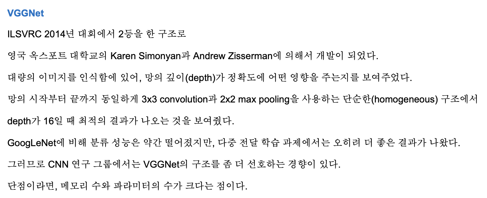

# VGGNet

Progress: Done
Tags: CNN
URL: https://arxiv.org/abs/1409.1556
논문 출판일: 2014년 9월 4일
리뷰 시작 날짜: 2022년 10월 2일
최종 편집 일시: 2023년 7월 1일 오후 8:37

- 이미지 인식 대회에서 갈수록 깊은 layer 구조를 가진 cnn 모델이 등장함.
    
    → 특히 2013년 이후부터는 10개 layer 이상 쌓여진 모델들이 등장하다가, resnet에 이르러서는 150개나 달하는 레이어를 보여줌
    

- 논문의 핵심
    1. 깊이를 증가하면 정확도가 좋아짐
    2. 3x3 filter를 여러 겹 사용하여 5x5, 7x7 filter를 분해하면 추가적인 비선형성을 부여하고 parameter의 수를 감소시킴
    3. pre-initialization을 이용하면 모델이 빠르게 수렴함
    4. data augmentation(resize, crop, flip)을 적용하면 다양한 scale로 feature를 포착할 수 있음
    5. 빠른 학습을 위해 4-GPU data parallerism을 활용함

### Abstract

- 위 논문에서는 3*3 convolutional layer를 연속적으로 사용해 층의 깊이와 정확도의 상관관계에 대해 알아보고자 함
- layer가 깊어짐에 따라 overfitting 문제와 gradient vanishing 문제가 발생할 수 있는데, 해당 논문에서 사용한 모델을 가지고 ImageNet Challenge 2014 의 classification 분야에서 2등을 차지함. 어떻게 문제점을 해결하고 대회 2등을 차지했는지 살펴볼 예정

### 1. Introduction

- computer vision은 최근 large-scale image와 video recognition 분야에서 뛰어난 성적을 거두고 있음
    1. Imagenet과 같은 large public image repository
    2. GPU와 같은 고성능 시스템의 발전
    3. ILSVRC과 같은 testbed 를 통해 지속적으로 발전해가고 있음

- Convnet이 CV 분야에서 대중적으로 되어감에 따라, 정확도 향상을 위한 다양한 시도가 이어짐
    
    → 작은 window size를 사용(ZFnet)
    
    → 이미지를 여러 사이즈(multiple scales)별로 학습시키는 방법 사용(OverFeat)
    

- 이 논문에서는 깊이에 초점을 맞추고자 함
    
    → 최종적으로 모든 파라미터를 고정시킨 채, 3*3 layer를 쌓아네트워크의 층만 깊어지게끔 만들어보고자 함
    
    → 결론적으로 ILSVRC classification 과 localization 에서 SOTA를 달성했음, 그리고 다른 이미지 데이터셋에서도 뛰어난 성능을 가지는 모델을 만들어냄.
    

### 2. ConvNet Configuration

- 깊이에 따른 변화를 측정하기 위해, 실험환경에서 conv layer의 파라미터를 동일하게 설정하고, Alexnet과 유사한 구조를 사용함

**2.1 Architecture**

- 학습에 사용된 input data 는 224*224 RGB 이미지를 사용함
    
    → 이미지 전처리에는 각 픽셀단위에 training set의 mean RGB 값을 추출하여 빼줌
    

- 가장 작은 receptive field를 갖는 convolutional lyaer를 사용함(3*3 filter)
    
    → 좌/우/위/아래/센터 를 가질 수 있는 최소단위 필터이기 때문
    

- 1*1 filter도 사용하였는데, 차원을 줄이고 non-linearity를 증가시키기 위해 사용함

- stride와 padding은 1로 설정

- Pooling layer는 총 5개의 max-pooling layer로 이루어져있고, 2*2 pixel window, stride 2 로 이루어짐

- Fully connected layer는 3개, 그 중 1~2번 layer는 4096 channel을 가지고, 3번째는 1000개의 channel을 가짐(ILSVRC 가 1000개의 class를 맞추는 이미지 세트이기 때문)

- 제일 마지막엔 soft-max layer가 있음

- 비선형 함수로는 ReLU를 사용함.

- 알렉스넷에서 사용되었던 LRN(Local Response Normalisation)은 사용하지 않음
    
    → 퍼포먼스적인 증가는 없고, 메모리와 컴퓨테이션 시간만 잡아먹기 때문
    

**2.2 Configurations**

- Depth 구조를 바꾸어가면서 11~19 depth로 변화시킴
- conv layer의 channel은 max pooling layer를 통과할때마다 2배로 커져서 최대 512까지 커짐
- depth가 늘어났다고 해도 더욱 큰 convoluntional size를 쓴 신경망보다 파라미터수가 적었음

**2.3 Discussion** 

- Alexnet에서 11*11 size를 사용했고, ZFnet에서 7*7 를 사용한것과는 다르게 VGGnet에서는 3*3 Receptive field를 사용함.

- 3*3 filter를 2개 사용하면 5*5, 3개 사용하면 7*7 의 효과를 동일하게 얻을 수 있음

- 7*7 보다 3*3 3개를 겹치는게 나은 이유
    1. ReLU를 3번 사용할 수 있어 non-linearity가 향상됨
        
        → decision function을 좀 더 discriminative하게 만들어줌
        
    2. 큰 사이즈의 필터를 사용했을때보다 오히려 파라미터의 개수는 줄어듦
        
        → 결론적으로 7*7 필터에 regularization을 가한것과 같아서 과적합을 줄이는 효과가 있음
        
    
- 그리고 Network in Network 구조에서 영감을 받은 1*1 conv layer를 사용하여, non-linearity를 강화시켜봄

### Classification Framework

**3.1 Training** 

- 학습 방법은 이미지 crop을 제외하고는 알렉스넷과 동일하게 진행됨

- Optimizing multinomial logistic regression
- mini-batch gradient descent
- batch size = 256, momentum = 0.9, weight decay = 0.0005(L2 penalty 사용), epoch = 74, learning rate = 0.01(10배씩 감소),
- 3개의 FCN 중 1, 2번째에 dropout(0.5) 적용
- validation set 정확도가 향상되지 않을 경우 10^-1 작아짐

- 모델은 알렉스넷과 비교하여 훨씬 깊은데도 불구하고 적은 epoch으로 학습이 가능했음
    1. 3*3 filter의 사용
    2. pre-initialisation 

<**Pre-initialisation>**

- 상대적으로 얕은 구조인 A모델을 먼저 학습시키고, 다른 모델을 학습시킬 때, A 모델에서 학습된 layer 가중치를 사용해 최적 초기값을 설정함
    
    → 각 가중치는 정규분포(평균 0 분산 0.01)를 따르는 임의의 값으로 초기화함
    
    → 어느정도 학습이 완료되면 처음 4개의 Conv layer와 마지막 3개의 FCN의 weight을 학습시킬 네트워크의 초기값으로 사용함
    
    ⇒ 일종의 전이학습같은 느낌?
    

**<Training image size>**

- Alexnet은 학습 이미지를 256*256으로 만들고, 224*224 크기의 이미지를 crop하고 뒤집어 총 2048배의 augmented 된 이미지를 얻어냄
- GoogLeNet은 영상의 가로/세로 비율을 (3/4, 4/3) 범위를 유지하면서 원본 영상의 8%~ 100%까지 포함할 수 있도록 하여 다양한 크기의 patch를 학습에 사용함.
    
    → photometric distortion을 사용해 학습 데이터를 늘리기도 함
    
- VGGNet에서는 training scale을 ‘S’로 표시하며, single-scale training과 multi-scaling training을 지원함
    
    → single의 경우는 S= 256 or 384, 2개의 고정 scale 이미지를 지원함
    
    → Multi-scale의 경우는 S를 Smin 과 Smax 중 무작위로 선택할 수 있음. Smin 은 256, Smax는 512로 되어있으며, 256~512 내에서 무작위로 scale을 정할 수 있기 때문에 다양한 크기에 대응이 가능해져 정확도가 향상됨
    
    → Multi-scale은 s=384로 먼저 학습을 시킨 뒤 S를 무작위로 선택해가면서 finetuning을 실시함
    
    ⇒ S가 랜덤하게 변하면서 학습이 이루어지기 때문에 이를 `scale jittering`이라고 부름
    

- 학습 데이터를 다양한 크기로 변환하고 일부분을 샘플링하여 사용하는것은 몇가지 효과가 생김
    1. 한정적인 데이터의 수가 늘어나는 data augmentation 효과
    2. 하나의 오브젝트에 대해 다양한 측면을 학습시킬 수 있음 
        
        → 변환된 이미지가 작으면 개체의 전체적인 모습을 학습하고, 변환된 이미지가 클수록 개체의 특정 부분만 학습에 반영시킬 수 있음
        
    
    ⇒ 위 두가지 효과로 overfitting이 방지됨
    

- 결론적으로 간단하면서도 높은 성능에 여러 모델의 backbone으로 많이 사용됨!
- 3*3 conv net, 1*1 conv net 사용 등 현재까지 사용된 여러 방식이 적용이 되었다는 의의!