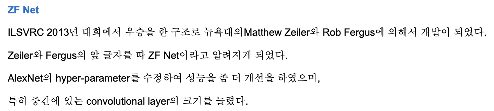

# ZFNet

Progress: Done
Tags: CNN
URL: https://arxiv.org/abs/1311.2901
논문 출판일: 2013년 11월 12일
리뷰 시작 날짜: 2022년 9월 25일
최종 편집 일시: 2022년 11월 13일 오후 8:47

참고링크([http://datacrew.tech/zfnet/](http://datacrew.tech/zfnet/) ) 

- CNN에서 여러 층을 쌓을 경우 어떤 원리로 좋은 결과를 내는지, 하이퍼 파라미터를 어떻게 수정해야하는지, 만들어낸 구조가 최적의 구조인지 판단하는것은 어려움
    
    → Alexnet의 경우 2개의 GPU로 일주일 이상 학습을 했는데, 하이퍼 파라미터 튜닝을 할때마다 일주일씩 기다릴 수 없음
    
    → CNN을 보다 잘 이해할 수 있는 수단이 필요했고, 이를 `Visualizing` 기법을 사용해서 해결하려함
    

- CNN의 동작을 잘 이해하려면 레이어 중간중간에서 feature의 activity가 어떤지 알아야함.
    
    → 하지만 중간 layer의 동작을 보기는 어려움
    
    → 그러면 중간 layer에서 생성되는 값들을 다시 input image size로 mapping 시키면 중간 결과를 확인할 수 있지 않을까?
    
    → 중간 layer에서 CNN 과정을 역으로 계산하면 중간 계층의 결과값을 눈으로 확인할 수 있을 것.
    

### 기존연구(AlexNet)와 다른 점

1. 1개의 GPU만으로 학습 : 2개의 GPU를 일부 층에서는 inter gpu 연산을, 나머지 일부에서는 intra gpu 연산을 시켰던 Alexnet과는 다르게 한개의 gpu만드로 학습을 취함
2. 좀 더 작은 size의 kernel filter와 stride 사용
3. 

### Introduction

- CNN과 같은 모델의 등장
    1. 많은 데이터
    2. Powerful GPU
    3. Dropout 과 같은 Regularization 기법의 등장
    
    으로 인해 Alexnet과 같은 모델이 이미지 분류 task에서 좋은 결과를 달성하지만, 어떻게 좋은 성능을 달성하게 되었는지 명확히 알지 못함
    
- 그래서 본 논문에서는 Deconvolutional Network(Deconvnet)을 제안함, 이를 통해 alexnet의 성능을 향상시킨 모델이 ZFNet
- 기존 방법에서는 첫번째 레이어의 Feature map 정도만 시각화 하는데 그쳤기 때문에 층이 깊어질 수록 어떻게 동작하는지를 명확하게 볼 수 없었음
    
    → 이 논문에서 사용된 Deconvnet을 통해 깊은 layer층에서 만들어진 Feature map 또한 시각화가 가능함을 제안함
    
    → feature map을 만들어내는 patter이 무엇인이 알려주는 filter를 시각화함
    

### Approach

- 일반적인 fully supervised convnet(AlexNet) 구조를 사용함
    
    → RGB 2차원 이미지를 받아서 어느 class에 속하는지 확률값을 보여주는 모델
    
    1. 이전 레이어의 output을 받아 convolution
    2. ReLU 통과
    3. max pooling & Local normalization
    - cross entropy 사용, SGD optimizer를 사용하고 backpropagtion으로 parameter update
    
    → 반복되는 1~3 과정의 activities를 다시금 pixel space로 표현하고자 하였고, 이를 위해 deconvolutional network를 사용함.
    
    → deconvnet은 filtering, pooling 과정을 동일하게 수행, 하지만 학습이 이루어지는것은 아님
    
    → alexnet의 과정을 평가하기 위해서, 각 conv layer를 통과하며 생긴 activation을 제외한 나머지 activation을 0으로 만들고, 만들어진 featuremap을 deconvnet의 input으로 만들어냄 
    
    → convnet의 과정을 역순으로 반복하여 unpool, rectify, filter 순으로 수행하며 reconstruction 실시
    

- Unpooling
    - map pooling 된 값을 거꾸로 얻어내는것은 불가능(max 값 제외하고는 사라지기 때문)
    - 그래서 2*2 의 경우 max값의 위치(1,2)와 같이 저장하여 unpooling시 활용함
        
        → `Switches`라는 형태의 variable로 이를 저장
        
        → 단점으로는 max(강한자극)을 제외한 약한 자극의 영향력은 알 수 없음
        

- Rectification
    - 앞서 unpooling된 값을 다시 한번 Relu 시켜줌
        
        → 어차피 max 값을 꺼내오는데 왜 relu를 씌위주는지는 잘 모르겠음…
        

- Filtering
    - convnet에 사용된 filter를 transpose 시켜 사용함
    - 원래의 convolutional이 stride를 갖고 input image를 계산하는 식을 보게 되면 아래와 같음
        
        
        
    - deconvolutional은 위의 이미지를 역순으로 계산하기 때문에 sparse matrix c를 transpose 시켜 output과 계산시키고, 역으로 input을 얻어내는 과정
        
        
        

- 주의할 점, Deconv 과정은 학습이 아니라 단순 계산으로 strong한 activation만 복원해내는 과정일 뿐임
    
    → 하나의 conv layer을 거치고 생성된 featur map이 kerner에서 어떤부분이 자극되었는지를  대략적으로 확인할 뿐임, 100% 복원되는것은 절대로 X
    

### Training details

- 대부분의 과정은 alexnet을 따라했지만, layer 3,4,5 에서 2 gpu를 이용한 연산 부분은 달라짐(ZFnet은 1 gpu로 계산했기 때문)

- ImageNet 2012 training set으로 학습됨
    
    → 130만개의 이미지, 1000개의 classes
    

- 256 size로 resize, 비율이 다른 사진은 256 * 256 이 되도록 center crop
    
    → 이후 224*224 size가 되도록 center + corner crop & horizontal flip
    

- 128 개의 minibatch 를 이용한 SGD optimizer 사용

- 학습률은 0.01, momentum 0.9, 0.5 dropout ratio, 0.5 FCN 사용
    
    → 초깃값은 0.01, bias 0
    

- GTX 580 GPU 1개를 가지고 12일간 학습, 70 epoches 에서 중지

### Convnet visualization

- layer 1,2 는 주로 Edge와 color 등 단순한 정보
layer 3는 보다 복잡한 texture
layer 4는 class별로 구체적인 특징에 해당하는 feature를(사물이나 개체의 일부분)
layer 5는 전체적으로 pose variation 한 결과를 보여줌(위치나 자세 변화 등이 포함된 사진)
- 학습 결과 edge와 같은 low-level feature는 학습이 시작되고 얼마되지 않아 시각적으로 결과를 확인할 수 있었지만, layer 4나 5와 같은 high-level feature는 거의 4~50 epoch이 지난 뒤에서야 결과를 확인할 수 있었음
    
    → 모델이 모든 layer가 제대로된 결과를 보여주려면 충분한 학습이 이뤄져야함을 알 수 있음
    

- 결과에서 CNN의 특징중 하나인 invariance 한 특성을 확인할 수 있음
    
    → 사진에 vertical translation, scale 확대, rotation을 가함
    
    → 1열은 입력 이미지, 2열은 변환 정도, 3열은 7번째 레이어의 반응, 4열은 output의 true label 확률
    
    → 상대적으로 rotation 변형에 대해 크게 영향을 받는다는것을 알 수 있음
    

### 4.1 architecture selection

- alexnet의 1, 2번 layer를 시각화했을 때 문제를 발견함
    
    → 1번 layer는 extremly high & low 한 frequency information을 가지고 있어 mid frequency를 잘 갖지 못함(dead feature 발생)
    
    → 이어서 2번 레이어는 너무 큰 stride를 지녀서 `aliasing`한 artifacts가 생김
    
    ⇒ 위 문제를 해결하기 위해 kernel_size를 11에서 7로 줄이고, stride를 4에서 2로 줄임
    
    ⇒ 이를 통해 실제로 classification 성능이 상승하기도 함
    

### 4.2 Occlusion Sensitivity

- 모델의 classification 과정을 보면서 드는 생각은 모델이 실제로 이미지 속 물체의 위치를 파악하는 것인지, 주변의 이미지를 보고 context 정보를 통해 파악하는가? 하는 것
    
    → 그래서 개체의 일부분만을 가려보고 정답을 맞춰보게 했을 때, 정답 확률이 감소하는것을 확인
    
    **→ 모델은 물체의 위치에 민감하게 반응하고 있다는 것이 맞다는 결론을 내림**
    
    **→ 그리고 ZFNet의 필터를 시각화하고 Alexnet의 구조를 일부 수정한것이 의미있다는것을 확인함**